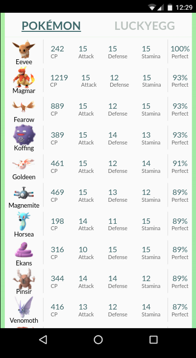
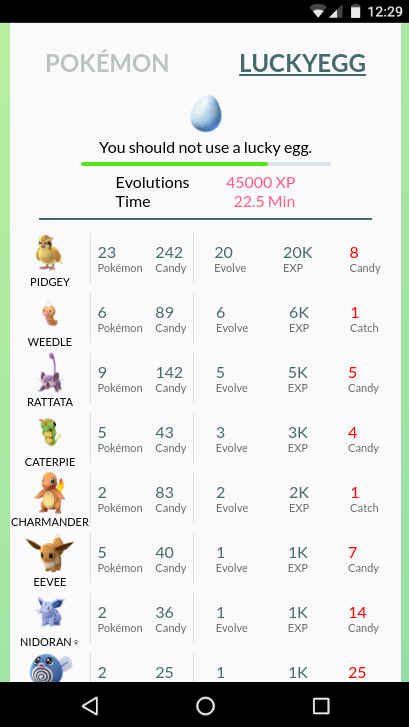

# pokemon-go-helper
It's starting to work!

## TODO
Geo cords at login (hardcoded atm)  
Fix Lucky Egg helper (need to tie in family obj to get candy count)  
Modularize css to component level  
Add dev/prod env switch for sending dummyData vs actual login  
Improve Login error handling  
Clean up all the TODOs  
Tests  
UI improvements  
Not sure if this is possible but idealy the pokemon go api should be entirely client side.  

## Features
#### Pokemon Stat Checker: Evaluate player's pokemon to help identify strong pokemon.  
  

#### Lucky Egg Helper: Evaluate player's pokemon and candies to see if they should use a lucky egg.  
  

## What this project isn't. 
I don't want to build something that lets you cheat. So that means.. 
* No bots
* No harvesters
* No map scanning

## Special Thanks
API that makes this all possible -> https://github.com/cyraxx/pogobuf  
Data used to polyfill pokedex data  -> https://github.com/Biuni/PokemonGOPokedex
